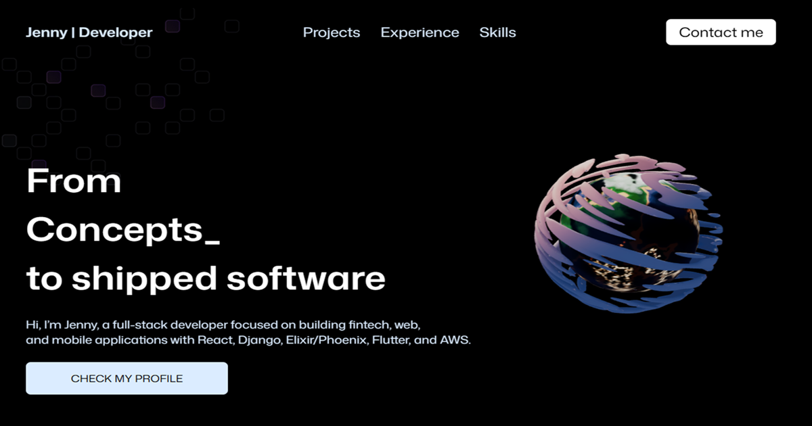

# 3D Portfolio



A 3D interactive portfolio.

The site highlights my production fintech experience, selected projects, technical stack, and contact details in a polished single-page React experience.

## Overview

This portfolio showcases my experience as a full stack developer, highlighting selected projects, technical skills, and professional background through an interactive 3D web experience.

## Tech Stack

- Frontend: React, JavaScript, Tailwind CSS
- 3D and animation: Three.js, React Three Fiber, Drei, GSAP
- Tooling: Vite, ESLint, Git
- Contact form: EmailJS

## Getting Started

Install dependencies:

```bash
npm install
```

Start the development server:

```bash
npm run dev
```

Run lint checks:

```bash
npm run lint
```

Create a production build:

```bash
npm run build
```

Preview the production build:

```bash
npm run preview
```

## Environment Variables

The contact form uses EmailJS. Create a `.env` file in the project root with:

```env
VITE_APP_EMAILJS_SERVICE_ID=your_service_id
VITE_APP_EMAILJS_TEMPLATE_ID=your_template_id
VITE_APP_EMAILJS_PUBLIC_KEY=your_public_key
```

Do not commit real environment values to the repository.

## Project Structure

```txt
src/
  components/      Reusable UI and 3D components
  sections/        Page sections such as Hero, Projects, Experience, Skills, Contact
  constants/       Portfolio data used across sections
  index.css        Tailwind CSS theme and custom styles
public/
  images/          Project images, icons, and visual assets
  models/          3D model assets
```

## Contact

- LinkedIn: [jenny-chen-chou](https://www.linkedin.com/in/jenny-chen-chou)
- GitHub: [JenC2](https://github.com/JenC2)
- Email: [jenny.chenchou@gmail.com](mailto:jenny.chenchou@gmail.com)


## Credits

This project includes the following third-party asset:

- **"Stylized planet"** by **cmzw**
- Source: https://skfb.ly/oyDUw
- License: CC BY 4.0

